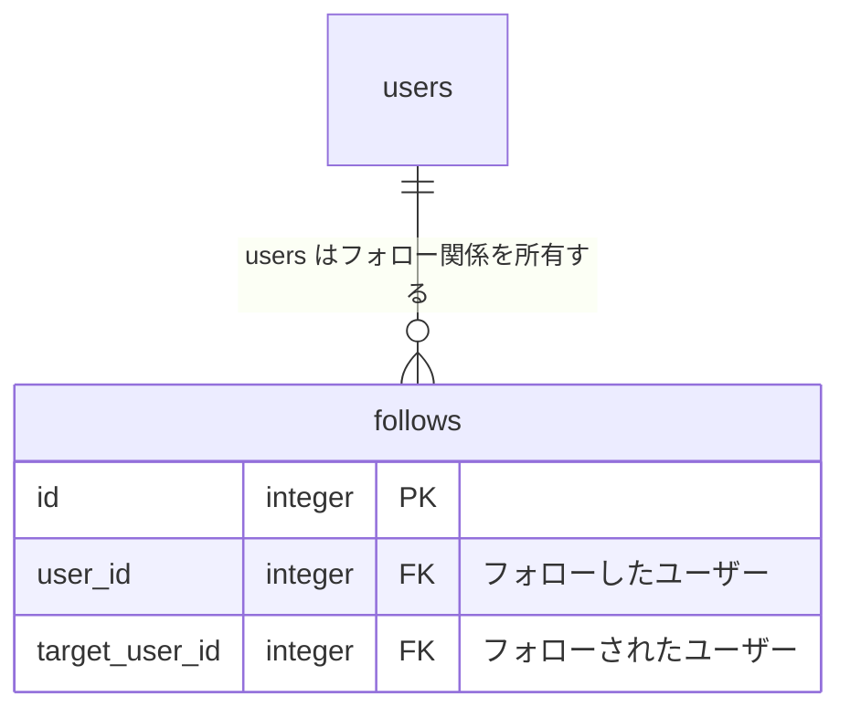

# Step 7: 👥 フォロー / アンフォロー機能

## 要件

他のユーザーをフォロー・アンフォローできるようにする

また、フォロー中のユーザーが作成したタスクを一覧表示できるようにする

## 詳細

### Rails

- 次のエンドポイントを作成する

| HTTP メソッド | パス | アクション名 | 用途 |
| --- | --- | --- | --- |
| `PUT` | `/api/users/follow/:target_user_id` | `create` | ユーザーをフォローする |
| `DELETE` | `/api/users/follow/:target_user_id` | `destroy` | ユーザーをアンフォローする |

- コントローラー名は `FollowsController` とする
- サインイン中のユーザーと対象ユーザーに紐づく `follows` レコードを作成・削除する
- リクエストからフォローする側の `user_id` を受け取ったり、指定したりしてはいけない
- サインイン中のユーザー自身はフォローできない
- 同じユーザーを重複してフォローできない
- 成功時は更新後のフォロー状態を HTTP ステータス 200 で返す

```json
{
  "user": {
    "id": 2,
    "is_following": true
  }
}
```

#### フォロー中ユーザーのタスク一覧

- Step 4 で作成した `GET /api/tasks` のクエリパラメーター `type` に `following` を追加する
- `type=following` ではフォロー中のユーザーが作成したタスクを取得する
- タスク自体の作成日時と ID の新しい順に並べる
- `completion`、`page`、15件ずつの追加読み込みを併用できるようにする
- タスク一覧の各要素に `is_following` を追加する
- フォロー状態の取得時に **N + 1問題** が発生しないようにする

```json
{
  "id": 1,
  "body": "タスク内容",
  "is_completed": false,
  "is_favorited": false,
  "is_following": true,
  "created_at": "2026-07-26T10:00:00.000+09:00",
  "user": {
    "id": 2,
    "name": "ユーザー名"
  }
}
```

### Vue

- 一覧の種類に「フォロー中のタスク」を追加する
- My タスク以外のタスクに「フォロー」または「アンフォロー」ボタンを表示する
- API を呼び出している間は、対象の投稿者に対するボタンだけを無効にする
- 同じ投稿者のタスクが複数表示されている場合は、すべての `is_following` を同時に更新する
- フォロー中のタスク一覧でアンフォローした場合は、対象投稿者のタスクを外した後、1ページ目から再取得する
- API の呼び出しに失敗した場合は変更前の状態に戻し、`window.alert` 関数でエラー内容をユーザーに知らせる
- API の呼び出し処理は既存の repository 層に追加する

### エラーハンドリング

- サインインしていない場合は HTTP ステータス 401 を返す
- 対象のユーザーが存在しない場合は HTTP ステータス 404 を返す
- フォローしていないユーザーをアンフォローしようとした場合は HTTP ステータス 404 を返す
- 自分自身またはフォロー済みのユーザーをフォローしようとした場合は HTTP ステータス 422 を返す
- `type` が `my`、`others`、`favorites`、`following` 以外の場合は HTTP ステータス 400 を返す
- エラー時は `{ "error": "エラー内容" }` を返す

### データベース

- `follows`: フォロー関係
  - `id`: 主キー
  - `user_id`: フォローしたユーザー
  - `target_user_id`: フォローされたユーザー
  - `user_id` と `target_user_id` の組み合わせは一意とする
  - 紐づくユーザーが削除された場合はフォロー関係も削除する



## 動作確認

- 他のユーザーをフォロー・アンフォローできる
- 自分自身や同じユーザーを重複してフォローできない
- フォロー中のタスク一覧に対象ユーザーのタスクだけが表示される
- 同じ投稿者の複数タスクでフォロー状態が同期される
- フォロー中の一覧からアンフォローした投稿者のタスクが一覧から外れる
- 完了状態の絞り込み、お気に入り状態、15件ずつの追加読み込みを併用できる

**📚 参考資料**

- [🔗 Active Record の関連付け - Railsガイド](https://railsguides.jp/association_basics.html)
  - 同じテーブル間の関連付けや `has_many :through` を学べます！
- [🔗 Active Record マイグレーション - Railsガイド](https://railsguides.jp/active_record_migrations.html)
  - 外部キーと一意インデックスを持つテーブルの作成方法を学べます！
- [🔗 リストレンダリング - Vue.js](https://ja.vuejs.org/guide/essentials/list.html)
  - 同じ投稿者のタスクを探し、表示状態を更新するための基礎を学べます！
